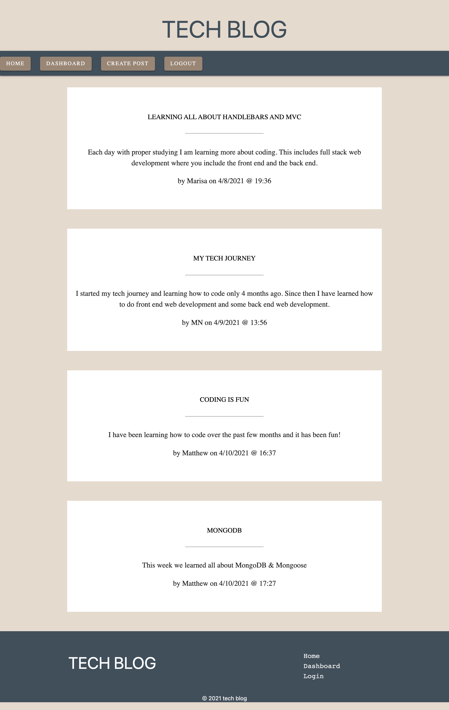
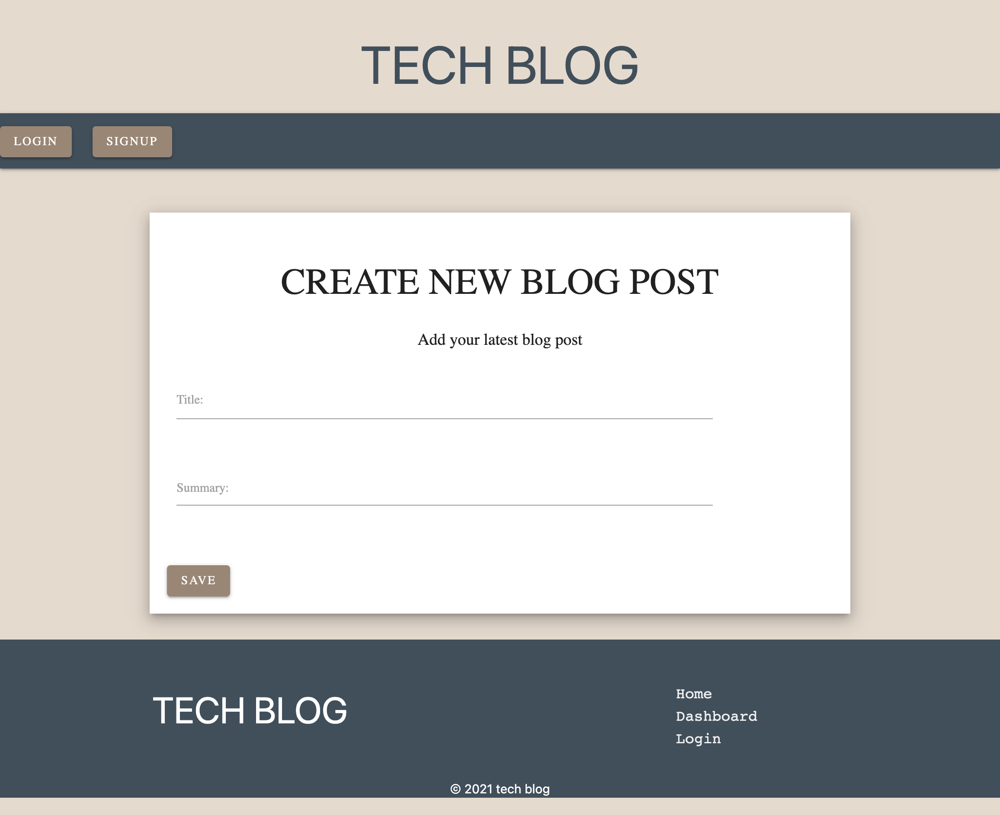
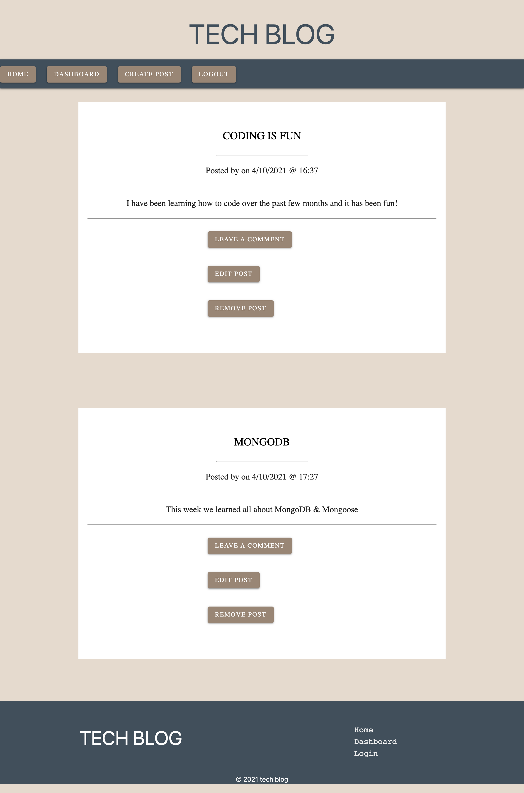

# Tech Blog 

 

## Table of Contents
* [Project Overview](#Project-Overview)
* [Application](#Application)
* [Installation](#Installation)
* [License](#License)
* [Questions](#Questions)

## Project Overview

## Application
[Tech Blog Heroku Link](https://drive.google.com/file/d/1-imu-rP9sOSufuA75wNergu142ZKp1Nn/view)

## Installation

To properly run this application you will need to install the following dependencies: 

* express-handlebars
* mySQL2
* Sequelize
* dotenv
* bcrypt
* express-session
* connect-session-sequelize

After initilizing the project and installing the dependencies you will need to run the schema.sql file in your MySQL Workbench or database to create the tech blog database. 

Once you have created the database you will need to run the following commands in your terminal to seed the database and begin listening on your server port.

1. npm run seed
2. npm start

After that is complete you will need to deploy the application to Heroku or a similar hosting site to view the blog online. 

## License

You can find out more about the MIT license on the open source page [here](https://www.opensource.org/licenses/MIT)

## Questions

Please contact me via email if you have any questions about this application.

* GitHub Profile: [github.com/marisanesmith](github.com/marisanesmith)

* Email: [marisanesmith@yahoo.com](marisanesmith@yahoo.com)